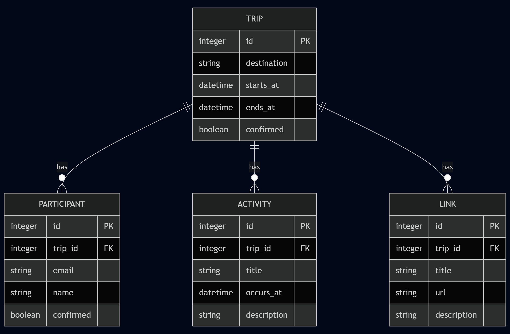

# Plann.er

A simple REST API for collaborative trip planning.

## Table of contents

- [Overview](#overview)
- [Core concepts](#core-concepts)
- [Typical workflow](#typical-workflow)
- [Postman collection](#postman-collection)
- [Development](#development)
- [ER diagram](#er-diagram)

## Overview

Plann.er is a REST API that helps teams plan trips together. Create trips with destinations and dates, invite participants by email, have participants confirm, and attach activities and helpful links.

## Core concepts

- Trip: holds `destination`, `starts_at`, `ends_at`, and confirmation status.
- Participant: invited by email; can confirm participation.
- Activity: scheduled item within a trip (for example, "Art Museum" at a specific time).
- Link: useful references related to the trip (for example, booking pages).

Common endpoints:

- POST /trips — create a trip
- GET /trips/{tripId} — fetch trip details
- PUT /trips/{tripId} — update destination or dates
- PATCH /trips/{tripId} — confirm the trip
- POST /trips/{tripId}/invite — invite a participant
- POST /participants/{participantId} — confirm a participant
- GET /trips/{tripId}/participants — list participants
- POST /trips/{tripId}/activities — add an activity
- POST /trips/{tripId}/links — add a helpful link

## Typical workflow

1. Create a trip: `POST /trips` with `destination`, `starts_at`, and `ends_at`. (Store returned `tripId`.)
2. Invite participants: `POST /trips/{tripId}/invite` with email. (Store `participantId`.)
3. Confirm a participant: `POST /participants/{participantId}` with participant details.
4. Add activities: `POST /trips/{tripId}/activities` with `title` and `occurs_at`.
5. Add helpful links: `POST /trips/{tripId}/links` with `title` and `url`.
6. Review trip details: `GET /trips/{tripId}`.
7. Confirm or update the trip: `PATCH /trips/{tripId}` to confirm; `PUT /trips/{tripId}` to update.

## Postman collection

The repo includes a Postman collection:

- `Plann.er.postman_collection.json`

Import into Postman:

1. Open Postman → Import → Choose File
2. Select `Plann.er.postman_collection.json`

The collection uses local URLs (<http://localhost:8080>) and sets collection variables such as `tripId` and `participantId` from responses during the workflow.

## Development

Run the API locally on port 8080 to use the Postman collection and exercise the endpoints.

## ER diagram

